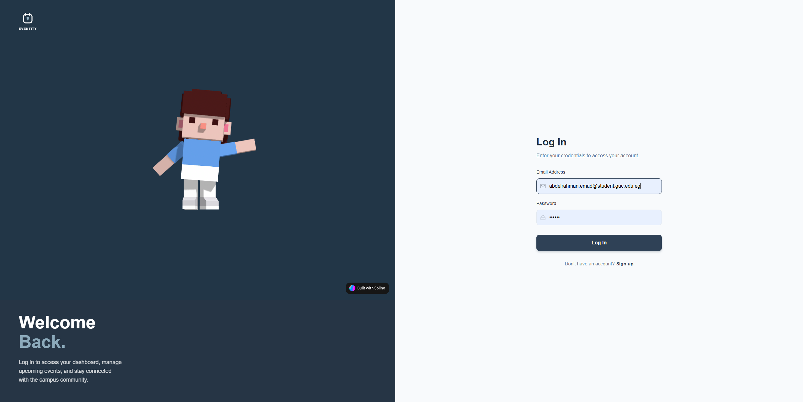
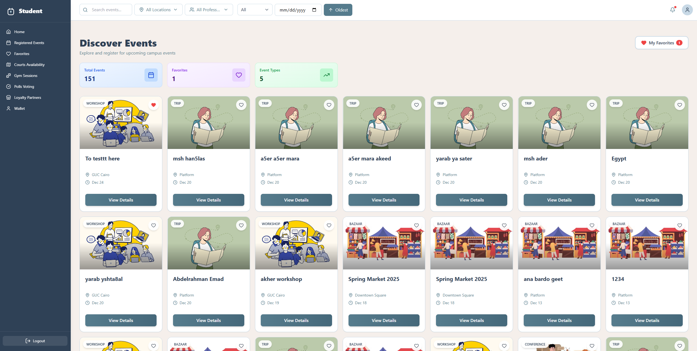
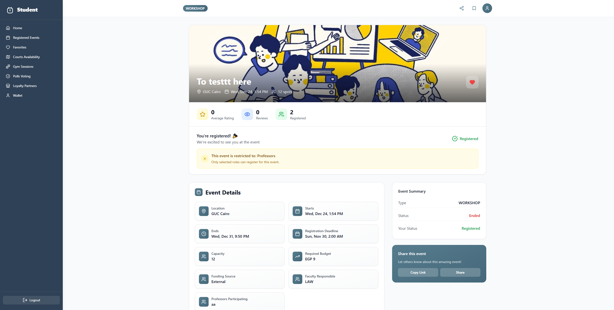
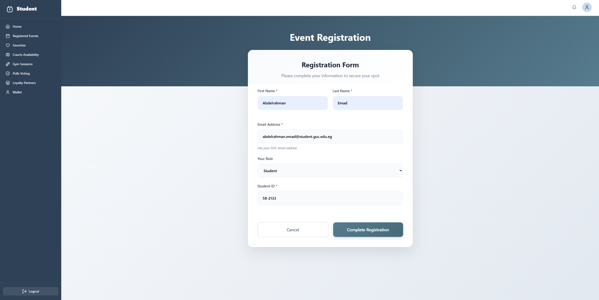
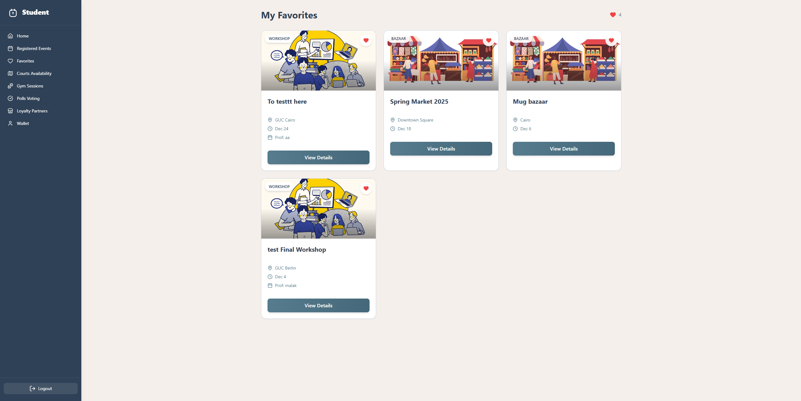
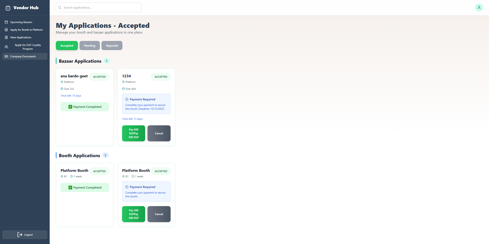
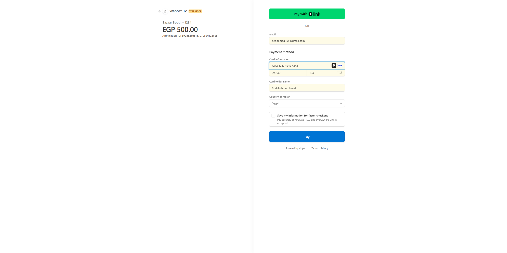
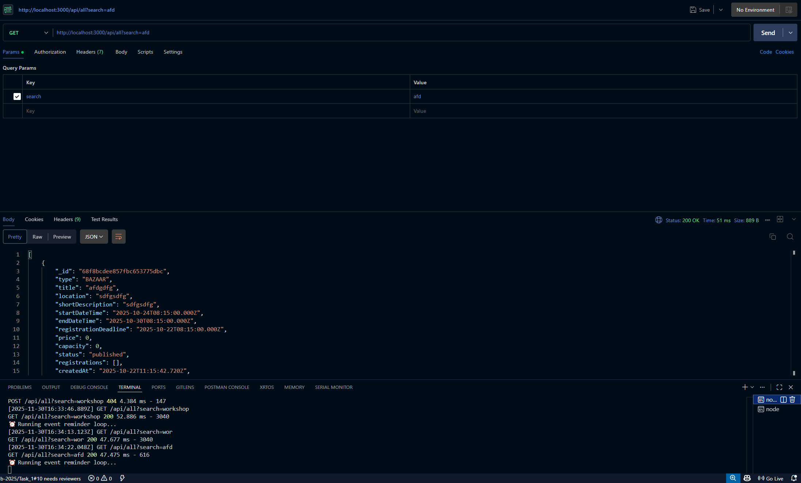
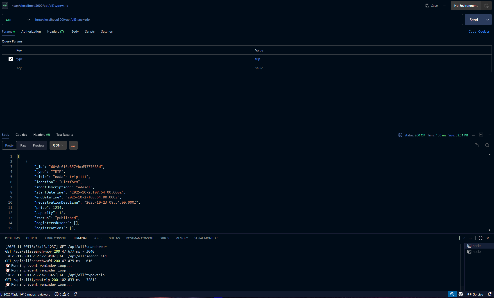
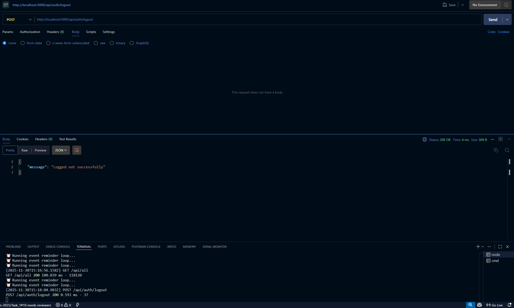

# Eventity
University Event Management Application

## 1. Motivation
Eventity is developed to provide a centralized system for managing university events, vendor participation, gym sessions, court reservations, workshop approvals, conference management, trip registrations, loyalty programs, and communication among students, staff, professors, vendors, and the Events Office.  
The goal of this system is to streamline event operations, automate approval cycles, ensure accurate role verification, provide structured registration workflows, and enhance the overall event participation experience for the university community.

## 2. Build Status
The system is functional on both frontend and backend with full connectivity to MongoDB.  
The following components are fully operational:

- User authentication (registration, login, logout)
- Verification emails for students, staff, TAs, and professors
- Vendor registration and document upload
- Event listing, filtering, searching, sorting
- Event registration and payment using Stripe
- Workshop, trip, bazaar, and conference creation
- Workshop approval cycle between Professors and Events Office
- Rating and commenting system
- Favorites feature
- Notifications and reminders
- Wallet refund logic
- Vendor participation workflows
- Court reservation system
- Gym schedule viewing and session registration
- Poll creation and voting
- Vendor loyalty program
- Reporting for total attendees and sales
- Document viewing and downloads

Known Issues / Limitations:
- Some frontend flows depend on manual refresh after backend operations
- Stripe webhook handling requires deployment for production reliability
- Some administrative views may require further UI refinement
- Form validations could be expanded
- File upload size and type restrictions can be enhanced
- Some asynchronous operations lack error boundary handling on the frontend

## 3. Code Style
- Naming convention: camelCase for variables and functions.
- Models use PascalCase.
- Controllers organized by functional modules.
- Routes separated by domain (auth, events, vendors, admin).
- Folder structure follows Node.js MVC methodology.

## 4. Screenshots
Screenshots located in:  
`/assets/screenshots/`

### 1. Signup Page


### 2. Login Page


### 3. Discover Events


### 4. Event Details


### 5. Event Registration Form


### 6. Favorites Page


### 7. Wallet Page


### 8. Vendor Booth Application


### 9. Vendor Accepted Applications


### 10. Payment Page


## 5. Technologies and Frameworks Used
Backend:
- Node.js  
- Express.js  
- MongoDB (Mongoose ORM)  
- Nodemailer  
- Stripe  
- JWT  
- Multer

Frontend:
- ReactJS  
- Axios  
- React Router  
- Context API
- Spline

Other:
- Stripe CLI

## 6. Features
The system supports all major user groups. Features include:

- Role-based authentication  
- Email verification  
- Vendor onboarding  
- Event browsing, filtering, sorting  
- Rating and commenting  
- Favorites  
- Event creation and approvals  
- Vendor participation workflows  
- Payments via Stripe  
- Wallet refunds  
- Notifications  
- Court reservations  
- Gym session registration  
- Voting polls  
- Loyalty program  
- Reporting  

## 7. Code Examples

### Example 1: User Registration Controller
```javascript
exports.registerUser = async (req, res) => {
    try {
        const { email, password, firstName, lastName, role, idNumber } = req.body;

        const existingUser = await User.findOne({ email });
        if (existingUser) return res.status(400).json({ message: "Email already registered" });

        const hashedPassword = await bcrypt.hash(password, 10);

        const user = new User({
            email,
            password: hashedPassword,
            firstName,
            lastName,
            role,
            idNumber,
            isVerified: false
        });

        await user.save();
        await sendVerificationEmail(user.email, user._id);

        res.status(201).json({ message: "Registration successful. Verification email sent." });
    } catch (error) {
        res.status(500).json({ error: error.message });
    }
};
```

### Example 2: Login Controller
```javascript
exports.loginUser = async (req, res) => {
    const { email, password } = req.body;

    const user = await User.findOne({ email });
    if (!user) return res.status(400).json({ message: "Invalid credentials" });

    if (!user.isVerified)
        return res.status(403).json({ message: "Please verify your email before logging in." });

    const passwordMatch = await bcrypt.compare(password, user.password);
    if (!passwordMatch) return res.status(400).json({ message: "Invalid credentials" });

    const token = jwt.sign({ id: user._id, role: user.role }, process.env.JWT_SECRET, {
        expiresIn: "7d"
    });

    res.status(200).json({ token, user });
};
```

### Example 3: Workshop Creation
```javascript
exports.createWorkshop = async (req, res) => {
    try {
        const workshop = new Workshop({
            ...req.body,
            professorId: req.user.id,
            status: "Pending"
        });
        await workshop.save();
        res.status(201).json(workshop);
    } catch (error) {
        res.status(500).json({ error: error.message });
    }
};
```

### Example 4: Stripe Payment
```javascript
exports.payForEvent = async (req, res) => {
    try {
        const { amount, eventId } = req.body;

        const paymentIntent = await stripe.paymentIntents.create({
            amount: amount * 100,
            currency: "egp",
            metadata: { eventId, userId: req.user.id }
        });

        res.send({ clientSecret: paymentIntent.client_secret });
    } catch (error) {
        res.status(500).json({ error: error.message });
    }
};
```

### Example 5: Notification Sender
```javascript
exports.sendNotification = async (userId, message) => {
    const notification = new Notification({
        userId,
        message,
        createdAt: new Date()
    });
    await notification.save();
};
```

## 8. Installation

### Backend
```
cd server
npm install
npm run dev
```

### Frontend
```
cd client
npm install
npm start
```

### .env.example
```
PORT=3000
MONGO_URI=YOUR_MONGO_URI
JWT_SECRET=YOUR_JWT_SECRET
EMAIL_USER=YOUR_EMAIL
EMAIL_PASS=YOUR_EMAIL_APP_PASSWORD
STRIPE_SECRET_KEY=YOUR_STRIPE_SECRET_KEY
STRIPE_WEBHOOK_SECRET=YOUR_WEBHOOK_SECRET
CLIENT_URL=http://localhost:3001
```

## 9. API References

### Authentication
```
POST /api/auth/signup
POST /api/auth/login
POST /api/auth/logout
GET /api/auth/me
```

---

### Events
```
GET /api/all
GET /api/events/:eventId
POST /api/events/:eventId/register
```

---

### Workshops
```
POST /api/workshops/create
GET /api/workshops/my-workshops
```

---

### Vendors
```
POST /api/vendor/apply
GET /api/vendor/my-requests
```

---

### Payments (Stripe)
```
POST /api/payments/create-session
POST /api/payments/pay-event
POST /api/payments/refund-event
POST /api/payments/confirm
POST /api/payments/confirm-event-payment
POST /api/payments/confirm-event-payment-and-email
```

---

### Reports
```
GET /api/reports/attendance
GET /api/reports/sales
```


### Authentication
```
POST /auth/register
POST /auth/login
GET /auth/verify/:id
```

### Events
```
GET /events
POST /events/register
GET /events/:id
```

### Payments
```
POST /payment/pay
POST /payment/webhook
```

### Vendors
```
POST /vendor/apply
GET /vendor/my-requests
```

### Workshops
```
POST /workshops/create
GET /workshops/my-workshops
```

## 10. Tests
Postman was used for testing.  
Screenshots stored under `/assets/screenshots/`.

### 1. Signup Test


### 2. Login Test


### 3. Get All Events


### 4. Search Events


### 5. Filter Events


### 6. Logout Test
  

## 11. Contribute

Contributions are welcome and encouraged to help improve Eventity.  
Please follow the contribution guidelines below to maintain code quality and consistency across the project.

### 1. Fork the Repository
Start by creating your own copy of the project:
- Click **Fork** on GitHub
- Clone your fork locally

git clone https://github.com/<your-username>/Eventity.git


---

### 2. Create a Feature Branch
All new work must be done on a dedicated feature branch.  
This keeps the `main` branch clean and stable.

git checkout -b feature/<feature-name>


Examples:
- `feature/vendor-qr-generation`
- `feature/enhanced-event-filtering`
- `feature/fix-stripe-webhooks`

---

### 3. Follow the Coding Style
To maintain code consistency:

- Use **camelCase** for variables & functions  
- Use **PascalCase** for models & components  
- Keep controllers modular and clean  
- Separate logic into controllers, routes, and services  
- Avoid bulky functions; break into helpers where needed  
- Remove unused imports and commented-out code before submitting  

---

### 4. Commit With Clear Messages
Write meaningful commit messages describing what you changed.

Examples:
git commit -m "Add: new event sorting by popularity"
git commit -m "Fix: vendor application validation error"
git commit -m "Update: improved email template for workshop approval"


---

### 5. Test Your Changes Before Submitting
Ensure that:

#### Backend Tests:
- Server runs without errors  
- All major flows still work (login, signup, event creation, vendor apply, payments)  
- Postman tests succeed  

#### Frontend Tests:
- App builds & loads properly  
- UI updates reflect new features  
- No console errors  

---

### 6. Submit a Pull Request (PR)
Once your feature is ready:

1. Push your branch:
git push origin feature/<feature-name>


1. Open a Pull Request describing:
   - The feature or fix  
   - Screenshots if UI-related  
   - Postman tests if backend-related  
   - Any issues resolved  

The maintainers will review your PR before merging.

---

### Important Contribution Rules
- Do NOT commit `.env` files or secrets  
- Do NOT commit to the `main` branch directly  
- Avoid adding large images or binaries outside `/assets/`  
- Ensure your branch is up to date with main before submitting a PR  

---

### Examples of Good Contributions
- Adding additional event filters or sorting 
- Improving UI responsiveness  
- Enhancing vendor workflows  
- Expanding Postman test coverage  
- Fixing validation or form errors  
- Improving Stripe payment flow reliability  

---

If you follow these guidelines, your contribution will be reviewed and merged efficiently.

## 12. Credits
- Stripe Documentation : [https://link-to-template](https://docs.stripe.com)
- Nodemailer Documentation : [https://link-to-template](https://nodemailer.com)
- MongoDB Documentation : [https://link-to-template](https://www.mongodb.com/docs/manual/core/databases-and-collections/)
- YouTube tutorials related to Node.js and React :
      -[https://link-to-video](https://youtu.be/Wa9KDiB7C_I?si=qwQdlOTMYWc0Uajg)
      -[https://link-to-video](https://youtu.be/lY6icfhap2o?si=E1JaLtEgPP9_gFLr)
      -[https://link-to-video](https://youtu.be/kk_JmicFVjE?si=J8fdW6vS0lAsIt1u)
- This project uses a modified version of a template created by [milicodes] on the Spline Community.
Original template: [https://link-to-template](https://app.spline.design/community/file/00b224f9-f286-4d99-bf6c-0c77496602ba)
Created/edited using Spline (https://spline.design).

## 13. License
This project is licensed under the Apache 2.0 License.
